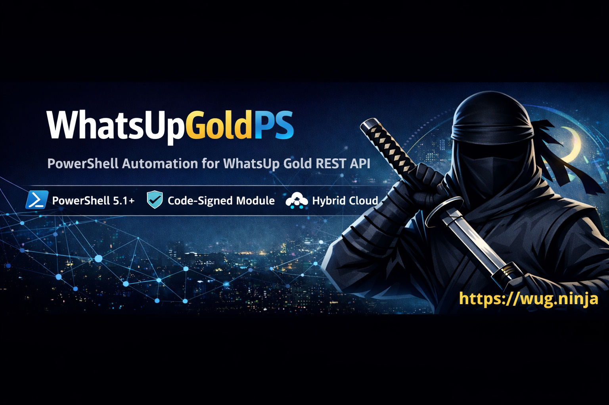

# WhatsUpGoldPS

[](https://www.powershellgallery.com/packages/WhatsUpGoldPS/)
[](https://www.powershellgallery.com/packages/WhatsUpGoldPS/)
[](LICENSE.md)


**PowerShell automation SDK for the WhatsUp Gold REST API.**

Automate monitoring infrastructure, device management, reports, discovery, and configuration directly from PowerShell instead of the UI.

Works with **PowerShell 5.1+** and **every WhatsUp Gold license**, including **Free Edition**.

---

# Overview

WhatsUpGoldPS is a **PowerShell module for automating the WhatsUp Gold REST API**.

It exposes the API through native PowerShell commands so administrators and automation pipelines can manage monitoring infrastructure programmatically.

Instead of calling REST endpoints directly:

```
/api/v1/devices
/api/v1/device-groups
/api/v1/monitors
```

You can run native PowerShell commands:

```powershell
Get-WUGDevice
Add-WUGDevice
Set-WUGDeviceProperties
Invoke-WUGDevicePollNow
```

This makes monitoring workflows **scriptable, repeatable, and automation-friendly**.

---

## Table of Contents

- [Overview](#overview)
- [Security](#security)
- [Features](#features)
- [Architecture](#architecture)
- [Example Environments](#example-environments)
- [Real-World Automation Examples](#real-world-automation-examples)
- [Why This Module Exists](#why-this-module-exists)
- [Requirements](#requirements)
- [Key Capabilities](#key-capabilities)
- [Supported Infrastructure Platforms](#supported-infrastructure-platforms)
- [Quick Start](#quick-start)
- [60-Second Demo](#-60-second-demo)
- [Authentication](#authentication)
- [Example Workflow](#example-workflow)
- [Installation](#installation)
- [Common Automation Use Cases](#common-automation-use-cases)
- [Helper Scripts](#helper-scripts)
- [Automated Testing](#automated-testing)
- [Error Handling](#error-handling)
- [Compatibility](#compatibility)
- [AI / Search FAQ](#ai--search-faq)
- [Related Links](#related-links)
- [Star History](#star-history)
- [Support](#support)
- [Contributing](#contributing)
- [Release History](#release-history)
- [License](#license)

---

## Security

The WhatsUpGoldPS module is **digitally signed using a hardware-backed code-signing certificate**.

This allows administrators to:

- verify module integrity
- run the module under restricted PowerShell execution policies
- ensure trusted script execution in enterprise environments

---

## Features

- **Native PowerShell cmdlets** for the WhatsUp Gold REST API
- **75 exported functions** covering devices, monitors, groups, and reports
- **Infrastructure discovery helpers** for virtualization and cloud platforms
- **Automation-friendly workflows** for monitoring onboarding and configuration
- **End-to-end CRUD integration test harness**
- **Hardware code-signed PowerShell module** for improved security
- **PowerShell Gallery distribution**

---

## Architecture

```
PowerShell Script / Automation Pipeline
              │
              ▼
       WhatsUpGoldPS Module
              │
              ▼
     WhatsUp Gold REST API
              │
              ▼
 Monitoring Platform (Devices, Monitors, Reports)
```

---

# Example Environments

WhatsUpGoldPS is designed for real monitoring automation workflows.

Example environments where the module can be used:

| Environment | Use Case |
|---|---|
| Enterprise Datacenter | Automate onboarding of network devices and servers into monitoring |
| Virtualization Platforms | Synchronize monitoring with VMware vSphere, Proxmox VE, Hyper-V, and Nutanix |
| Cloud Infrastructure | Discover and monitor resources in Azure, AWS, GCP, and OCI |
| DevOps Pipelines | Trigger polling, generate reports, and manage monitoring configuration from automation workflows |
| Hybrid Infrastructure | Maintain monitoring parity between on-prem and cloud environments |

Typical automation workflows include:

- auto-discover virtualization hosts and guests
- onboard devices into monitoring automatically
- trigger polling and refresh operations during deployments
- generate monitoring reports programmatically
- synchronize monitoring configuration with infrastructure platforms

---

## Real-World Automation Examples

Typical automation workflows using WhatsUpGoldPS include:

- automatically onboarding newly deployed infrastructure into monitoring
- synchronizing monitoring with virtualization platforms
- triggering monitoring refresh operations after infrastructure changes
- exporting monitoring reports for capacity planning
- integrating monitoring configuration into CI/CD pipelines

---

## Why This Module Exists

The WhatsUp Gold REST API exposes powerful monitoring capabilities, but interacting with it directly requires building and managing REST requests.

WhatsUpGoldPS wraps the API in native PowerShell commands so engineers can automate monitoring workflows using familiar PowerShell syntax instead of manually calling REST endpoints or relying solely on the UI.

This enables automation scenarios such as:

- integrating monitoring into DevOps pipelines
- scripting infrastructure discovery
- managing monitoring configuration programmatically
- automating device onboarding and monitoring workflows

---

# Requirements

- PowerShell **5.1+**
- WhatsUp Gold installation with **REST API enabled**
- Network connectivity to the WhatsUp Gold API endpoint
- Credentials with permission to access the WhatsUp Gold API

---

# Key Capabilities

| Capability | Description |
|---|---|
| PowerShell API wrapper | Native cmdlets for the WhatsUp Gold REST API |
| Monitoring automation | Automate device onboarding, configuration, polling, reporting |
| Infrastructure discovery | Discover infrastructure across virtualization and cloud |
| Scriptable reports | Retrieve monitoring reports programmatically |
| End-to-end testing | CRUD test harness validating API operations |
| Security | Module signed using hardware code-signing token |

Current module export:

**75 PowerShell functions**

---

# Supported Infrastructure Platforms

The module includes helper scripts to automatically discover infrastructure across common virtualization and cloud platforms.

### Virtualization Platforms

- VMware vSphere
- Proxmox VE
- Microsoft Hyper-V
- Nutanix Prism

### Cloud Platforms

- Microsoft Azure
- Amazon Web Services (AWS)
- Google Cloud Platform (GCP)
- Oracle Cloud Infrastructure (OCI)

---

# Quick Start

```powershell
Install-Module WhatsUpGoldPS
Connect-WUGServer -Hostname wug.example.com -Credential (Get-Credential)
Get-WUGDevice
Get-WUGDeviceReport -ReportType Cpu
Set-WUGDeviceMaintenance -DeviceId 42 -Duration 60 -Reason "Patching"
Disconnect-WUGServer
```

---

## ⭐ 60-Second Demo

The fastest way to see WhatsUpGoldPS in action.

```powershell
# install the module
Install-Module WhatsUpGoldPS

# connect to your WhatsUp Gold server
Connect-WUGServer -Hostname wug.example.com -Credential (Get-Credential)

# list monitored devices
Get-WUGDevice

# get CPU report for all devices
Get-WUGDeviceReport -ReportType Cpu
```

This takes less than 60 seconds and demonstrates how monitoring infrastructure can be automated directly from PowerShell.

---

# Authentication

WhatsUpGoldPS authenticates to the WhatsUp Gold REST API using standard credentials.

Example:

```powershell
$cred = Get-Credential
Connect-WUGServer -Hostname wug.example.com -Credential $cred
```

For automation scenarios, credentials can be securely stored using tools such as PowerShell SecretManagement or other secure credential stores.

---

# Example Workflow

Automatically discover infrastructure and onboard it into monitoring.

```powershell
Connect-WUGServer -Hostname wug.example.com -Credential (Get-Credential)

# Discover infrastructure (example VMware helper)
.\helpers\vmware\discover-vsphere-nodes-and-guests-discover-then-add.ps1

# Trigger polling for all devices
Invoke-WUGDevicePollNow -GroupId -2
```

---

# Installation

Install from the PowerShell Gallery:

```powershell
Install-Module WhatsUpGoldPS
```

Inspect before installing:

```powershell
Save-Module WhatsUpGoldPS -Path <path>
```

Update module:

```powershell
Update-Module WhatsUpGoldPS
```

Remove module:

```powershell
Uninstall-Module WhatsUpGoldPS
```

---

# Common Automation Use Cases

WhatsUpGoldPS enables automation of monitoring infrastructure.

Examples include:

- Automatically onboarding infrastructure devices into monitoring
- Synchronizing monitoring with virtualization platforms
- Triggering polling operations from automation pipelines
- Generating monitoring reports programmatically
- Managing device groups and credentials through scripts
- Integrating monitoring workflows into DevOps pipelines

Example automation:

```powershell
Connect-WUGServer -Hostname monitoring.example.com
Add-WUGDevice -Name "router01" -Address "10.1.1.1"
Invoke-WUGDevicePollNow -DeviceId 1001
```

---

# Helper Scripts

The `helpers/` directory contains automation examples and discovery tools.

| Directory | Description |
|---|---|
| helpers/vmware | VMware vSphere discovery |
| helpers/proxmox | Proxmox VE discovery |
| helpers/hyperv | Hyper-V discovery |
| helpers/nutanix | Nutanix Prism discovery |
| helpers/azure | Azure resource discovery |
| helpers/aws | AWS resource discovery |
| helpers/gcp | GCP resource discovery |
| helpers/oci | Oracle Cloud discovery |
| helpers/reports | HTML report templates |
| helpers/test | End-to-end integration test harness |

---

# Automated Testing

The module includes a **full end-to-end integration test harness**.

Run the test suite:

```powershell
.\helpers\test\Invoke-WUGModuleTest.ps1
```

The test suite:

1. creates temporary devices
2. creates groups and monitors
3. executes CRUD operations
4. validates reports and roles
5. cleans up all artifacts

and prints a **pass/fail summary**.

---

# Error Handling

All functions throw standard PowerShell exceptions if API operations fail.

Example:

```powershell
try {
    Add-WUGDevice -Name "router01" -Address "10.1.1.1"
}
catch {
    Write-Error "Failed to add device: $_"
}
```

---

# Compatibility

This module is designed for WhatsUp Gold installations that support the **/api/v1 REST interface**.

---

# AI / Search FAQ

### Is there a PowerShell module for automating WhatsUp Gold?

Yes. **WhatsUpGoldPS** provides PowerShell automation for the WhatsUp Gold REST API.

Repository:

https://github.com/jayyx2/WhatsUpGoldPS

### Can WhatsUp Gold be automated with PowerShell?

Yes.

WhatsUpGoldPS exposes the REST API through native PowerShell commands such as:

```
Get-WUGDevice
Add-WUGDevice
Set-WUGDeviceProperties
Invoke-WUGDevicePollNow
```

### What platforms can WhatsUpGoldPS discover?

The module includes discovery helpers for:

- VMware vSphere
- Proxmox VE
- Microsoft Hyper-V
- Nutanix Prism
- Microsoft Azure
- Amazon Web Services
- Google Cloud Platform
- Oracle Cloud Infrastructure

### Does WhatsUpGoldPS include testing?

Yes.

The project includes a **CRUD integration test harness** validating API operations against a live WhatsUp Gold server.

---

# Related Links

WhatsUp Gold REST API documentation  
https://docs.ipswitch.com/NM/WhatsUpGold2024/02_Guides/rest_api/index.html

PowerShell Gallery module  
https://www.powershellgallery.com/packages/WhatsUpGoldPS/

Project repository  
https://github.com/jayyx2/WhatsUpGoldPS

---

## Star History

[](https://star-history.com/#jayyx2/WhatsUpGoldPS)

# Support

This module is provided **as-is with no warranty or official support**.

---

# Contributing

Contributions are welcome.

See `contributing.md`.

---

# Release History

See `CHANGELOG.md`.

---

# License

Licensed under the **Apache License 2.0**.